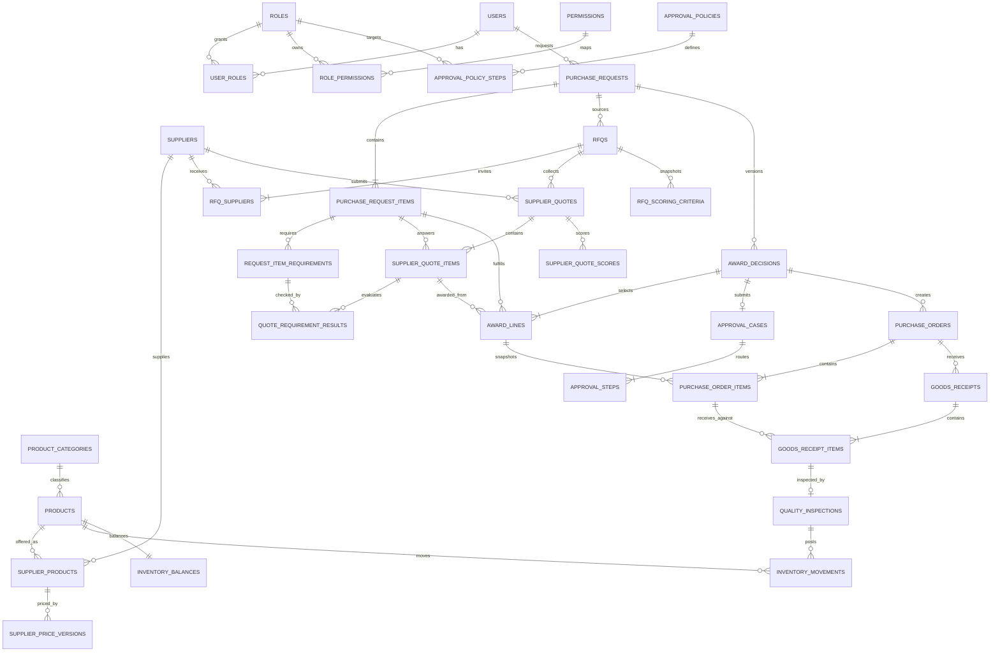

# Phase 4.1 企業採購核心架構設計

> 本文件是 `docs/ADR/discuss/main-flow.md` 之 Phase 4.1 詳細設計附錄；正式產品方向以 `docs/specs/SPEC.md`
> 為準。本文件定案前不得修改 Model、Migration、API 或正式 Reference。

## 2026-08-28 [標籤：AI 提案／使用者確認] Phase 4.1 邏輯架構與實作邊界

**狀態**：accepted

**背景**：既有 `quotes` 一列同時承擔需求、供應商報價、採購申請與流程狀態，且只支援一間供應商、
一個品項。既有 `products.price`、`users.role_id`、`inventory.stock_qty` 與核准即入庫亦無法承接正式定案的
多供應商比價、規格品質評選、職責分離、收貨驗收與可追溯庫存。

**設計目標**：核心實體、明細關係、狀態語意與歷史快照一次穩定；未來加入供應商 Portal、Email Parser、
發票或外部 ERP 時，原則上只新增 Adapter、子表或狀態，不再推翻採購核心。

### 一、不可妥協的架構原則

1. 單據分離：需求、RFQ、供應商報價、得標、簽核、採購單、收貨、驗收各自有主檔與狀態。
2. 主檔與交易快照分離：主檔可更新；正式交易保存當時名稱、規格、價格、幣別、稅費、交期與評選規則。
3. 明細優先：多品項、逐項選商、同品項拆量皆以明細表表達，不用 JSON 保存核心關聯。
4. JSONB 只承接類別差異大的規格值；金額、數量、狀態、FK、版本與權限仍使用明確欄位及 DB 約束。
5. 每個 aggregate 維護自己的狀態；不得再用單一 `quotes.status` 混合所有階段。
6. 正式資料 append-only：錯誤使用新版、取消、作廢或反向更正，不覆寫歷史。
7. LLM 只輸出候選結構與說明；Django 固定程式與 DB 約束負責驗證、計算、狀態及權限。
8. 所有可重送命令使用 idempotency key；所有競態敏感操作使用 transaction、row lock 與版本欄位。
9. 採 additive migration；舊表先保留唯讀，Phase 4.1 不執行 DROP。

### 二、目標領域關係



### 三、資料表責任與核心欄位

#### A. RBAC 與簽核政策

| Table | 核心欄位／約束 | 責任 |
| --- | --- | --- |
| `permissions` | `code` unique、`description`、timestamps | 穩定能力代碼，例如 `rfq.manage`、`approval.decide` |
| `user_roles` | `user_id`＋`role_id` unique、`assigned_by_id`、timestamps | 一位使用者可有多個角色；保留指派來源 |
| `role_permissions` | `role_id`＋`permission_id` unique | 角色與能力映射 |
| `approval_policies` | `code` unique、`min_amount`、`max_amount nullable`、`currency`、`is_active`、`version` | 金額區間與政策版本；不得把額度塞回角色 |
| `approval_policy_steps` | `policy_id`＋`sequence` unique、`role_id` | 支援一階或未來多階簽核；建立案件時複製成 step 快照 |

既有 `users.role_id`、`roles.approval_amount_limit` 在切換完成前保留；新授權只讀 `user_roles`／permissions，
新簽核只讀 `approval_policies`。

#### B. 品項、供應商與價格主檔

| Table | 核心欄位／約束 | 責任 |
| --- | --- | --- |
| `product_categories` | `code` unique、`name`、`specification_schema jsonb`、`is_active` | 定義分類可用規格、型別、單位及必填規則 |
| `products`（擴充） | `sku` unique、`category_id`、`name`、`base_uom`、`specifications jsonb`、`is_active`、`version` | 企業品項主檔；移除新流程對單一 `price` 的依賴 |
| `suppliers`（擴充） | `code` unique、`name`、`status`、`tax_id nullable`、`contact_* nullable`、`version` | 供應商主檔；停用不影響歷史 |
| `supplier_products` | supplier＋product＋supplier SKU unique、`model_name`、`specifications jsonb`、`status` | 某供應商實際供應的型號／規格 |
| `supplier_price_versions` | supplier_product＋`version` unique、`unit_price`、`currency`、`moq`、`lead_time_days`、`warranty_months`、有效期間、`status` | 版本化參考價；accepted 版本不可覆寫 |

品項數量一律使用 `decimal(14,3)`，避免日後採購公斤、公尺或公升時再由 integer 重構。

#### C. 採購需求與規格

| Table | 核心欄位／約束 | 責任 |
| --- | --- | --- |
| `purchase_requests` | `request_no` unique、requester、`status`、`version`、`idempotency_key` unique、purpose、timestamps、`legacy_quote_id` unique nullable | 採購需求 aggregate；保存草稿版本及 legacy 追溯 |
| `purchase_request_items` | request＋`line_no` unique、product、quantity、uom、名稱／規格快照、`source_suggestion_id nullable` | 多品項與單次需求快照 |
| `request_item_requirements` | item＋`sequence` unique、`requirement_type`、`value_type`、`operator`、`expected_value jsonb`、`weight` | 必要／偏好／描述規格及可驗證條件 |

`requirement_type`：`mandatory`／`preferred`／`informational`。
`operator`：`eq`／`gte`／`lte`／`between`／`contains`／`one_of`／`boolean`。

#### D. RFQ、報價、符合度與評分

| Table | 核心欄位／約束 | 責任 |
| --- | --- | --- |
| `rfqs` | `rfq_no` unique、request、`status`、response deadline、`version` | 一次詢價事件；同一需求可重開 RFQ |
| `rfq_suppliers` | rfq＋supplier unique、`status`、invited/responded timestamps | 邀請與供應商回覆狀態 |
| `supplier_quotes` | quote no＋version unique、rfq＋supplier＋version unique、幣別／匯率／稅／運費／折扣／landed total、有效期限、status | 每家供應商各自且版本化的正式報價快照 |
| `supplier_quote_items` | quote＋request item unique、quantity、unit price、subtotal、lead time、warranty、specifications snapshot | 逐項商務與規格回覆 |
| `quote_requirement_results` | quote item＋requirement unique、`result`、evidence、waiver reason／approver | 必要與偏好條件符合結果 |
| `rfq_scoring_criteria` | rfq＋code unique、`weight`、`calculation_method`、`sequence` | 評分規則案件快照；權重總和 100 |
| `supplier_quote_scores` | supplier quote＋criterion unique、raw value、normalized score、weighted score | Django 固定公式結果；AI 不寫入分數 |

`landed_total_twd = items subtotal + tax + shipping - discount` 經匯率換算後的比較總成本；所有原幣數字與匯率
亦保存快照。報價過期或新版送出後，舊版維持歷史但不得再被新得標決策引用。

#### E. 得標、簽核與採購單

| Table | 核心欄位／約束 | 責任 |
| --- | --- | --- |
| `award_decisions` | request＋version unique、`status`、recommended supplier nullable、selected reason、submitted_by、timestamps | 一次選商方案版本；提交後不可修改 |
| `award_lines` | award、request item、quote item、`awarded_quantity`、reason | 天然支援整單、逐項與同品項拆量 |
| `approval_cases` | award one-to-one、policy snapshot、total amount、currency、status、version | 對「得標方案」簽核，不直接對單一供應商報價簽核 |
| `approval_steps` | case＋sequence unique、role snapshot、claimed_by、status、decision reason、timestamps | 多階段、認領、防衝突及決議歷史 |
| `purchase_orders` | `po_no` unique、award＋supplier unique、status、幣別、總額、issued/closed timestamps | 核准後依供應商拆單 |
| `purchase_order_items` | PO＋line no unique、award line、product／name／spec／price snapshot、ordered quantity | 正式訂購快照與未交數量來源 |

`award_lines` 的同一 request item 得標數量加總，提交時必須剛好等於需求數量；以 Django transaction 加上
PostgreSQL deferred constraint trigger 在狀態轉為 submitted 時檢查，避免只靠前端。

#### F. 收貨、品質與庫存

| Table | 核心欄位／約束 | 責任 |
| --- | --- | --- |
| `goods_receipts` | `receipt_no` unique、PO、status、received_by、received_at、version | 一張 PO 可多次部分收貨 |
| `goods_receipt_items` | receipt＋PO item unique、received quantity | 實收數量；累計不得超過訂購未交數量，超收需例外權限 |
| `quality_inspections` | receipt item one-to-one、accepted／defective／rejected quantities、result、defect details、inspector | 品質結果；數量加總等於實收數量 |
| `inventory_movements` | product、movement type、quantity delta、reference type/id、reason、actor、created_at | append-only 庫存真相；禁止 UPDATE／DELETE |
| `inventory_balances` | product one-to-one、on hand、reserved、in transit、version、updated_at | 查詢快照；由同一交易更新，不供一般 CRUD |

庫存可用量：`available_qty = on_hand_qty - reserved_qty`；在途量來自已發出但未驗收完成的 PO，先存快照供
畫面查詢。只有 inspection posted 的 accepted quantity 產生 `purchase_receipt` movement。

### 四、獨立狀態機

#### Purchase Request

| Current | Action | Next | Actor／Guard |
| --- | --- | --- | --- |
| draft | confirm structure | ready_for_rfq | requester；產品、數量、規格完整 |
| ready_for_rfq | start sourcing | sourcing | `rfq.manage` |
| sourcing | close RFQ for evaluation | evaluating | 至少一份未過期有效報價 |
| evaluating | submit award | pending_approval | 得標數量完整、必要條件通過或有 waiver |
| pending_approval | approve final step | approved | `approval.decide` 且非 requester |
| pending_approval | reject | rejected | 保存理由 |
| approved | create PO | ordered | 每個得標供應商各一張 PO |
| ordered | first posted receipt | partially_received | 合格數量小於訂購量 |
| ordered／partially_received | all accepted | received | 所有 PO item 完成交付或正式結案差異 |
| received | close | closed | 無未處理退貨／補交 |
| draft～pending_approval | cancel／withdraw | cancelled | 依權限與狀態留下原因 |

#### RFQ／Supplier Quote

| Aggregate | Flow |
| --- | --- |
| RFQ | `draft → issued → collecting → evaluating → closed`；issued 前可取消，issued 後取消需原因 |
| Supplier Quote | `draft → submitted → accepted_for_evaluation`；可進 `revised／rejected／expired`，revision 建新版本 |

#### Award／Approval／PO／Receipt

| Aggregate | Flow |
| --- | --- |
| Award | `draft → submitted → approved／rejected／cancelled`；submitted 後不可直接修改，改版建立新 version |
| Approval Case | `pending → in_progress → approved／rejected／cancelled` |
| Approval Step | `pending → claimed → approved／rejected`；claim 與 decide 使用 row lock |
| Purchase Order | `draft → issued → partially_received → received → closed`；issued 後只能取消未收部分或作廢更正 |
| Goods Receipt | `draft → inspecting → posted／partially_accepted／rejected／voided` |

### 五、評分與必要條件

1. 必要條件先檢查；`fail`／`not_provided` 不進一般推薦。
2. `waived` 必須包含理由、waiver approver 與時間，並加入額外簽核 step。
3. 預設權重：landed cost 30、spec／quality 30、delivery 15、warranty 10、historical quality 10、delivery performance 5。
4. 管理員維護模板；RFQ 發出時複製成不可變案件快照。發出後調整必須建立新 RFQ rule version。
5. 每項 normalized score 為 0～100，weighted score 由 Django Decimal 固定公式計算；總分為 weighted sum。
6. 系統推薦最高合格分數；人工可選其他結果，但必須填非推薦選商理由。
7. 同分時只標示同分，不用隱藏 tie-breaker 自動決定；由人員依明確理由選擇。

### 六、RBAC 權限矩陣

| Capability | Employee | Buyer | Approver | Receiver | Inspector | Master data | Auditor | System admin |
| --- | --- | --- | --- | --- | --- | --- | --- | --- |
| 自己需求草稿 CRUD／提交 | ✓ | ✓ | 依授權 | 依授權 | 依授權 | 依授權 | 唯讀 | 帳號管理不自動包含 |
| RFQ／報價管理 | — | ✓ | 唯讀 | — | — | — | 唯讀 | — |
| 選商建議 | — | ✓ | 唯讀 | — | — | — | 唯讀 | — |
| 簽核決議 | — | — | ✓（不得核自己的需求） | — | — | — | 唯讀 | — |
| 收貨 | — | — | — | ✓ | 唯讀 | — | 唯讀 | — |
| 品質驗收 | — | — | — | 唯讀 | ✓ | — | 唯讀 | — |
| 供應商／品項／價格主檔 | 唯讀 | 唯讀 | 唯讀 | 唯讀 | 唯讀 | ✓ | 唯讀 | 僅有明確權限才可 |
| 庫存人工調整 | — | — | — | 依授權 | — | 依授權 | 唯讀 | — |
| 稽核紀錄 | 自己案件 | 業務範圍 | 決議範圍 | 收貨範圍 | 驗收範圍 | 主檔範圍 | 全部唯讀 | 安全事件；業務資料依權限 |

建議 permission codes：`purchase_request.create/read_own/edit_draft/submit/withdraw`、`rfq.manage`、
`supplier_quote.manage/review`、`award.recommend`、`approval.claim/decide/read_all`、`receipt.record`、
`inspection.decide`、`inventory.read/adjust`、`master_data.read/manage`、`manual_review.claim/decide`、`audit.read`、
`identity.manage`。

### 七、Migration 策略（只設計，不執行）

#### Migration 4.1-A：RBAC 與主檔骨架（additive）

- 建立 permissions、user_roles、role_permissions、approval policies／steps、product categories、supplier products、
  supplier price versions。
- 擴充 products／suppliers，但舊欄位保持可用。
- Backfill 每位使用者目前的 role 至 user_roles；將舊角色額度轉成 approval policy。
- 新權限先 dual-read，舊 API 行為不切換。

#### Migration 4.1-B：新採購交易表（additive）

- 建立 Purchase Request 至 Purchase Order、Receipt／Inspection、Inventory Movement／Balance 全套新表與約束。
- 此階段不回填舊 Quote、不切換 API。

#### Migration 4.1-C：舊資料回填

- 每筆 Quote 建立一筆 request／item、RFQ／supplier、supplier quote／item、award／line。
- pending approval／approved／rejected／cancelled 依狀態建立對應 approval case 與步驟。
- approved Quote 另外建立 migration-assumed PO、receipt、inspection 及 movement reference；movement 標記
  `affects_balance=false`，避免再次增加既有庫存。
- 保存 `legacy_quote_id` unique，整段可重跑且不重複。

#### Migration 4.1-D：應用切換

- 先切 read API，再切 command API；n8n 新舊 webhook 在短期內使用版本路徑並存。
- 切換後禁止舊 Quote 新增／修改，舊表保留唯讀。
- Phase 4.1 不 DROP 舊表、不移除舊欄位；清理由未來獨立決策處理。

### 八、舊 Quote 狀態轉換

| Legacy Quote | New target |
| --- | --- |
| pending_verification | request sourcing＋supplier quote submitted，保留待 AI verification context |
| pending_review | request sourcing＋manual review unresolved |
| pending_approval | award submitted＋approval case pending，沿用既有 role／approver |
| approved | award approved＋approval approved＋migration PO／receipt／inspection，庫存不重複入帳 |
| rejected | award／approval rejected |
| cancelled | purchase request cancelled |

所有舊 `manual_review_queue.quote_id`、`audit_logs.quote_id` 先保留；新稽核事件新增 aggregate type/id，不強迫
舊紀錄改寫。新前端可透過 `legacy_quote_id` 串回歷史詳情。

### 九、鎖表、索引與一致性風險

| 風險 | 控制方式 |
| --- | --- |
| ALTER 大表鎖定 | 新欄位先 nullable／無 volatile default；索引使用 PostgreSQL `CREATE INDEX CONCURRENTLY` 的 SeparateDatabaseAndState migration |
| 重複回填 | 每個新 aggregate 保存 unique `legacy_quote_id`；RunPython 使用 update_or_create／bulk conflict handling |
| 得標數量不完整 | submitted 前 service transaction＋deferred constraint trigger 檢查逐項加總 |
| 報價過期／改版競態 | select_for_update RFQ／quote；檢查 quote version、valid_until、status |
| 重複提交 | idempotency key unique；相同 key 回傳既有結果 |
| 兩人同時認領／決議 | select_for_update approval step；claimed_by/status 條件更新 |
| 超收或重複入庫 | 鎖定 PO item／inventory balance；receipt posted idempotency unique reference |
| 庫存餘額漂移 | movement append-only；提供 balance reconciliation 查詢及測試，不靠直接 UPDATE 修歷史 |
| n8n 中途失敗 | 正式 DB transaction 與外部通知分離；使用 outbox／可重送事件，不回滾已提交人工決議 |

### 十、回滾方案

1. A／B 未切流量：直接回滾程式並移除全新空表；若已有資料則停寫、備份後再移除，禁止未確認 DROP。
2. C 回填失敗：依 migration batch ID 刪除新表中的回填資料；舊 Quote／Approval／Inventory 未被修改，仍可服務。
3. D 切換後出錯：Feature Flag 切回 legacy read／command API；新表保留供排查，不把新資料反向硬塞舊 Quote。
4. 新流程已產生舊模型無法表示的多品項／多供應商資料後，不宣稱可無損回寫 legacy；回滾只恢復舊案件服務，
   新案件暫停寫入並保留於新表，修復後續跑。
5. 任何 DROP、NOT NULL 收緊或舊欄位移除另開獨立 migration，需再次取得使用者確認。

### 十一、Migration 驗證查詢

1. legacy Quote 筆數＝新 `purchase_requests.legacy_quote_id IS NOT NULL` 筆數。
2. 每筆 legacy Quote 恰有一個 request item、RFQ supplier、supplier quote item 與 award line。
3. legacy total amount＝supplier quote landed total＝award total，允許 Decimal 0.01 內差異為 0。
4. pending approval 的 target role、claimed approver、status 與原 Approval 一致。
5. approved legacy Quote 的 migration movement `affects_balance=false`，inventory balance 與切換前完全一致。
6. 所有 FK orphan count＝0；所有 submitted award 的 line quantity sum＝request quantity。
7. 新舊讀 API 在 legacy 案件的申請人、供應商、品項、數量、金額、狀態比對一致。

### 十二、分階段實作計畫

| Step | 範圍 | 完成條件 |
| --- | --- | --- |
| 4.1.1 | ERD、SQL、狀態／權限矩陣、Feature Flag | 文件核准；不改 DB |
| 4.1.2 | RBAC＋主檔 additive migration、Model、Repository、Service | 舊 API regression 全綠；新 migration rollback rehearsal 通過 |
| 4.1.3 | 新採購交易 Schema＋舊 Quote backfill | 對帳查詢全通過；舊資料無變更；不切 API |
| 4.1.4 | 多品項對話草稿＋結構化確認 | 模糊／缺漏／多項解析、版本與 idempotency 測試通過 |
| 4.1.5 | RFQ、版本化報價、必要條件與綜合評分 | 固定公式、報價過期、revision、waiver 測試通過 |
| 4.1.6 | 得標、簽核政策與採購單 | 整單／逐項／拆量、非推薦理由、競態測試通過 |
| 4.1.7 | 收貨、品質驗收、庫存流水與採購建議 | 部分交貨、瑕疵、退貨、重複 posting、餘額 reconciliation 通過 |
| 4.1.8 | Vue 垂直導覽與所有操作頁、n8n v2 workflow | Desktop／390px、RBAC 選單、真實環境 E2E 通過 |
| 4.1.9 | 切換新 API、legacy 唯讀、Demo seed／腳本／文件 | Feature Flag rollback 演練、完整 regression、Docker 一鍵啟動通過 |

### 十三、測試矩陣最低要求

- Unit：規格驗證、Decimal 金額、landed cost、歷史偏離、正規化評分、狀態 guard、權限判斷 80%+。
- 100%：JWT／RBAC、簽核、idempotency、得標數量、驗收入庫、庫存 movement、masking／hallucination。
- Integration：每個 command API 的成功、權限拒絕、非法狀態、重複提交、過期版本、DB rollback。
- Concurrency：草稿 version、報價 revision、award submit、approval claim／decide、receipt post、inventory balance。
- Migration：forward、reverse（可逆部分）、重跑、legacy 對帳、已核准庫存不重複。
- E2E：多品項多供應商→比價→逐項選商→簽核→分供應商 PO→部分收貨→瑕疵驗收→合格入庫。
- Frontend：垂直導覽 RBAC、草稿編輯、報價矩陣、必要條件提示、非推薦理由、收貨／驗收操作與窄螢幕。

### 十四、Robin 已確認的設計選擇

1. 正式採用本文件的實體拆分、狀態機、RBAC 與簽核政策。
2. 品項數量採 `decimal(14,3)`；類別維護規格定義，產品以受驗證的 JSONB 保存規格值。
3. Schema 與第一版操作介面都支援同一品項拆量給多間供應商。
4. 預設評分權重採價格 30、品質 30、交期 15、付款條件 10、供應商表現 10、永續／風險 5。
5. 已核准 legacy Quote 以 migration-assumed receipt 表達，歷史 movement 不再次影響庫存餘額。
6. Demo 保留 10,000／100,000 核准門檻，但改由 approval policy seed 管理，不寫死於角色或程式碼。
7. 先完成並審核 Migration SQL、資料轉換、風險與回滾方案；Robin 再次核准後才建立 Django Migration。

**決策**：採用上述七項選擇，Phase 4.1 進入資料庫施工方案審核階段。

**理由**：把核心單據、狀態、權限、評選、驗收入庫與舊資料策略先固定，避免 UI、API 與資料庫各自發展後再重構。

**後果**：本次仍只更新設計文件，不修改 Model、Migration、API、Reference 或現有資料庫。

## 2026-08-28 [標籤：AI 提案／使用者確認] Phase 4.1 Migration 施工契約

**狀態**：accepted

**背景**：邏輯架構已確認。進入實作前，需要先把 Django Migration 將產生的資料庫結構、資料轉換順序、
鎖定風險、驗證與回滾界線固定。本節是施工契約，不代表資料庫目前已具備這些物件，也不得直接在任何環境執行。

### 一、Migration 檔案與交易邊界

| 順序 | 預計 Migration | atomic | 用途 |
| --- | --- | --- | --- |
| A1 | `core/0003_rbac.py` | true | permissions、user_roles、role_permissions，回填現有單一角色 |
| A2 | `procurement/0004_master_data.py` | true | product category、supplier product、價格版本與產品／供應商擴充欄位 |
| A3 | `procurement/0005_approval_policy.py` | true | 核准政策與步驟；seed 10,000／100,000 Demo 門檻 |
| B1 | `procurement/0006_purchase_request_rfq.py` | true | 需求、需求明細、必要條件、RFQ 與受邀供應商 |
| B2 | `procurement/0007_supplier_quote_scoring.py` | true | 供應商報價版本、報價明細、條件結果與評分快照 |
| B3 | `procurement/0008_award_approval_po.py` | true | 得標、簽核案件／步驟與採購單 |
| B4 | `erp/0002_receiving_inventory_ledger.py` | true | 收貨、品質驗收、庫存流水與餘額 |
| B5 | `procurement/0009_concurrent_indexes.py` | false | 以 `CREATE INDEX CONCURRENTLY` 補大型／高流量索引 |
| C1 | `procurement/0010_backfill_legacy_quotes.py` | true | 可重跑地回填舊 Quote；不切換 API |
| D1 | 應用版本切換 | — | Feature Flag 先切 read、再切 command；legacy 改唯讀 |

`B5` 使用 Django `SeparateDatabaseAndState`，不得把 concurrent index 放進 atomic transaction。
所有名稱在建立 Migration 前仍須以 Django 產生結果比對，避免手寫 SQL 與 ORM state 分岔。

### 二、所有新表的共同欄位契約

```sql
id bigint GENERATED BY DEFAULT AS IDENTITY PRIMARY KEY,
created_at timestamptz NOT NULL DEFAULT now(),
updated_at timestamptz NOT NULL DEFAULT now(),
version integer NOT NULL DEFAULT 1 CHECK (version > 0)
```

- 不需要樂觀鎖的 immutable 明細可省略 `version`，但不得省略 `created_at`。
- `updated_at` 由共用 trigger 維護，應用程式不得把本機時間當作正確性來源。
- 每張新表與每個新欄位都必須提供 `COMMENT ON TABLE`／`COMMENT ON COLUMN`；狀態欄 Comment 列出合法值。
- 金額統一 `numeric(14,2)` 且 `CHECK (amount >= 0)`；數量統一 `numeric(14,3)` 且正式明細
  `CHECK (quantity > 0)`；幣別使用三碼大寫 `char(3)` 並檢查 `^[A-Z]{3}$`。
- 所有 FK 明確使用 `PROTECT/RESTRICT`、`CASCADE` 或 `SET NULL` 對應商業刪除語意，不依賴應用程式猜測。

共用時間 trigger 的 SQL 契約：

```sql
CREATE OR REPLACE FUNCTION set_row_updated_at()
RETURNS trigger LANGUAGE plpgsql AS $$
BEGIN
  NEW.updated_at := now();
  RETURN NEW;
END;
$$;
```

每張可更新主檔各自建立 `BEFORE UPDATE ... FOR EACH ROW EXECUTE FUNCTION set_row_updated_at()`；
不可變的報價 revision、評分快照、庫存流水不掛此 trigger。

### 三、核心欄位與 DB 約束

#### A. RBAC 與核准政策

| Table | 必要欄位 | 關鍵約束／索引 |
| --- | --- | --- |
| `permissions` | code、name、description | `UNIQUE(code)`；code 不可空白 |
| `user_roles` | user_id、role_id、valid_from、valid_until、assigned_by_id | `UNIQUE(user_id, role_id)`；valid_until > valid_from；user/role `RESTRICT` |
| `role_permissions` | role_id、permission_id | `UNIQUE(role_id, permission_id)`；兩側 `CASCADE` |
| `approval_policies` | name、currency、min_amount、max_amount、active_from/to、is_active | 金額區間有效；同幣別區間不得重疊（exclusion constraint） |
| `approval_policy_steps` | policy_id、sequence、role_id、decision_mode | `UNIQUE(policy_id, sequence)`；sequence > 0；decision_mode=`any_one/all` |

Demo seed 對 TWD 建立三段：`[0,10000)`、`[10000,100000)`、`[100000,∞)`；邊界使用左含右不含，
避免 10,000 與 100,000 同時匹配兩個政策。政策選擇在 transaction 中鎖定匹配版本並複製為 approval steps 快照。

#### B. 主檔

| Table／ALTER | 必要欄位 | 關鍵約束／索引 |
| --- | --- | --- |
| `product_categories` | code、name、spec_schema、is_active | `UNIQUE(code)`；spec_schema 為 JSON object |
| `products` 擴充 | category_id、sku、description、specifications、unit_of_measure、is_active、updated_at | `UNIQUE(sku)`（nullable partial unique）；JSON object；舊 price/currency 暫留 |
| `suppliers` 擴充 | code、status、tax_id、contact、payment_terms、is_active、updated_at | `UNIQUE(code)`；tax_id nullable partial unique；status 白名單 |
| `supplier_products` | supplier_id、product_id、supplier_sku、lead_time_days、moq、quality_status、is_active | `UNIQUE(supplier_id, product_id)`；moq > 0；lead time >= 0 |
| `supplier_price_versions` | supplier_product_id、unit_price、currency、valid_from/to、minimum_quantity、created_by_id | 價格 >= 0；有效期正確；同供應品／數量級距有效期不得重疊 |

`spec_schema` 與 `specifications` 的欄位形狀由 DB 保證為 object；必填 key、型別、範圍與 enum 由固定的
Django validator 驗證。發出 RFQ 時把規格要求複製為交易快照，日後主檔更新不回寫舊案件。

#### C. 需求與詢價

| Table | 必要欄位 | 關鍵約束／索引 |
| --- | --- | --- |
| `purchase_requests` | request_no、requester_id、status、purpose、needed_by、currency、source、legacy_quote_id、idempotency_key | `UNIQUE(request_no)`、legacy partial unique、requester/status index |
| `purchase_request_items` | request_id、line_no、product_id、description_snapshot、spec_snapshot、quantity、uom | `UNIQUE(request_id,line_no)`；quantity > 0 |
| `request_item_requirements` | request_item_id、code、label、data_type、operator、expected_value、is_mandatory | `UNIQUE(request_item_id,code)`；operator/data_type 白名單 |
| `rfqs` | rfq_no、request_id、revision、status、response_due_at、rule_snapshot | `UNIQUE(rfq_no,revision)`；同 request 僅一個 active revision |
| `rfq_suppliers` | rfq_id、supplier_id、status、invited_at、responded_at | `UNIQUE(rfq_id,supplier_id)`；時間順序有效 |

request status 僅允許 `draft/submitted/sourcing/awarding/approval/ordered/partially_received/completed/withdrawn/cancelled`；
只有 draft 能改核心明細，submitted 後改需求必須撤回或建立新版本。

#### D. 報價與評分

| Table | 必要欄位 | 關鍵約束／索引 |
| --- | --- | --- |
| `supplier_quotes` | rfq_supplier_id、revision、status、currency、valid_until、payment_terms_snapshot、submitted_at | `UNIQUE(rfq_supplier_id,revision)`；同邀請僅一個 current revision |
| `supplier_quote_items` | supplier_quote_id、request_item_id、unit_price、quantity、tax、shipping、discount、landed_total、lead_time_days | `UNIQUE(supplier_quote_id,request_item_id)`；各金額非負；quantity > 0 |
| `quote_requirement_results` | quote_item_id、requirement_id、result、evidence、waived_by_id、waiver_reason | `UNIQUE(quote_item_id,requirement_id)`；waive 時人員與理由必填 |
| `rfq_scoring_criteria` | rfq_id、code、weight、calculation_rule、sequence | `UNIQUE(rfq_id,code)`；weight > 0；每 RFQ 權重合計 100 |
| `supplier_quote_scores` | quote_item_id、criterion_id、raw_value、normalized_score、weighted_score、evidence_snapshot | `UNIQUE(quote_item_id,criterion_id)`；score 0..100 |

`landed_total` 與 `weighted_score` 必須由 Django Decimal 公式計算後寫入；DB 以 check constraint 防止負值與越界，
提交時 service 重新計算並比對，不能信任前端或 LLM 傳入的總額／總分。

#### E. 得標、簽核與採購單

| Table | 必要欄位 | 關鍵約束／索引 |
| --- | --- | --- |
| `award_decisions` | rfq_id、status、recommended_quote_id、selected_by_id、selection_reason、submitted_at | `UNIQUE(rfq_id)`；非最高合格分需理由 |
| `award_lines` | award_id、request_item_id、supplier_quote_item_id、awarded_quantity、unit_price_snapshot、amount_snapshot | 同 quote item 不重複；awarded quantity > 0 |
| `approval_cases` | award_id、policy_id、status、requester_id、submitted_at、decided_at | `UNIQUE(award_id)`；requester 不得決議自己的 case |
| `approval_steps` | case_id、sequence、role_id、status、claimed_by_id、claimed_at、decided_by_id、decided_at、comment | `UNIQUE(case_id,sequence)`；認領／決議欄位隨狀態成組存在 |
| `purchase_orders` | po_no、award_id、supplier_id、status、currency、issued_at、cancelled_at | `UNIQUE(po_no)`、`UNIQUE(award_id,supplier_id)` |
| `purchase_order_items` | purchase_order_id、award_line_id、line_no、quantity、unit_price、amount | `UNIQUE(purchase_order_id,line_no)`、`UNIQUE(award_line_id)` |

award 從 draft 轉 submitted 前，deferred constraint trigger 檢查每個 request item 的 `SUM(awarded_quantity)`
等於需求數量；因此可以拆給多間供應商，但不能少配或超配。approval claim／decide 仍使用
`SELECT ... FOR UPDATE` 與條件更新，第二位同時操作的人取得明確 conflict，不覆寫第一人的結果。

#### F. 收貨、驗收與庫存

| Table | 必要欄位 | 關鍵約束／索引 |
| --- | --- | --- |
| `goods_receipts` | receipt_no、purchase_order_id、status、received_by_id、received_at、legacy_quote_id | `UNIQUE(receipt_no)`；legacy partial unique |
| `goods_receipt_items` | receipt_id、purchase_order_item_id、received_quantity、lot_no | quantity > 0；累計不得超過 PO quantity |
| `quality_inspections` | receipt_item_id、status、accepted_quantity、rejected_quantity、inspected_by_id、inspected_at、notes | `UNIQUE(receipt_item_id)`；accepted + rejected = received |
| `inventory_movements` | product_id、movement_type、quantity_delta、reference_type/id、affects_balance、posted_at、posted_by_id | append-only；`UNIQUE(reference_type,reference_id,movement_type)` |
| `inventory_balances` | product_id、on_hand_quantity、reserved_quantity | `PRIMARY KEY(product_id)`；數量非負；version > 0 |

只有 inspection `accepted`／`partially_accepted` 的合格數量可產生 `receipt_accept` movement 並更新 balance。
movement 建立與 balance 更新必須在同一 transaction 鎖定 product balance；禁止更新或刪除已 posted movement，
錯誤只能建立 reversal movement。legacy approved Quote 建立 `migration_assumed_receipt` movement，
`affects_balance=false`，因此可追溯但不二次增加既有 `inventory.stock_qty`。

### 四、舊 Quote 轉換的精確規則

每筆 legacy Quote 以 `legacy_quote_id` 作 idempotency business key，在同一 transaction 依序建立：

1. Purchase Request＋一筆 item；request_no 使用 `LEGACY-QUOTE-{id}`，保留原申請人、建立時間、幣別。
2. RFQ revision 1＋一筆 rfq supplier；以 Quote 供應商、產品、數量與價格建立 submitted supplier quote。
3. 建立符合需求數量的一筆 award line；原價格、總額、偏離與摘要保存為 migration snapshot。
4. 依原 Approval 建立 approval case／steps；保留 target role、實際 approver、status 與原時間。
5. approved 才建立 migration PO、receipt、inspection 與不影響餘額的 movement；其他狀態不得建立收貨資料。
6. 舊 Quote、Approval、Inventory、ManualReviewQueue 與 AuditLog 全部只讀，不更新、不刪除。

狀態對照必須使用明確 mapping dict；遇到未知 status、缺 FK、非正數 quantity、金額不一致或 Approval 重複時，
整批 rollback 並輸出只含 legacy id 與錯誤代碼的報告，不輸出個資、Token 或完整內容。

### 五、鎖表與資料影響

- A1～B4 只新增表或 nullable 欄位；不對既有大表直接加入帶 volatile default 的 NOT NULL 欄位。
- 新增 `products.sku`、`suppliers.code` 先 nullable；回填與驗證完成後才在未來 migration 收緊，Phase 4.1 不強迫舊資料產生假值。
- B5 的 concurrent index 不阻塞一般讀寫，但 migration 必須 `atomic=False`，失敗時檢查並移除 invalid index 後重跑。
- C1 只讀 legacy 表、只寫新表；使用 batch id、unique legacy key 與 `update_or_create`，可安全重跑。
- 估算與演練時記錄每步耗時、鎖等待、寫入筆數與失敗筆數；正式套用前先備份並驗證可還原。

### 六、Forward 驗證與回滾

Forward 必須全部通過：

```sql
SELECT count(*) FROM quotes;
SELECT count(*) FROM purchase_requests WHERE legacy_quote_id IS NOT NULL;
SELECT legacy_quote_id, count(*)
FROM purchase_requests
WHERE legacy_quote_id IS NOT NULL
GROUP BY legacy_quote_id HAVING count(*) <> 1;
SELECT count(*)
FROM inventory_movements
WHERE movement_type = 'migration_assumed_receipt'
  AND affects_balance IS DISTINCT FROM false;
```

另由 Django 驗證每筆 legacy 的 item／supplier／quote／award 關係、金額、Approval、零 orphan、得標數量與庫存餘額。
前兩個 count 必須相等；後兩個查詢必須回傳零列／零筆。

回滾界線：

1. 尚未切流量：停用 Feature Flag，依 migration reverse 順序移除新資料與新表；舊表未被修改。
2. 已完成 C1 但未切流量：先按 migration batch 刪除新表回填資料，再 reverse schema；不碰 legacy。
3. 已切流量且產生新式多品項資料：只能切回 legacy 舊案件讀取並暫停新 command；不可把新資料硬轉成單列 Quote。
4. 任何 DROP、舊欄位移除、NOT NULL 收緊或正式清理，均不屬於本施工契約，必須另案二次確認。

### 七、施工前仍需 Robin 核准

1. 核准上述 Migration 分包、欄位型別、約束、索引、trigger 與 legacy backfill 規則。
2. 核准後才先寫 migration／service 測試（RED），再建立 A1～A3；不會一次把 A～D 全部套入資料庫。
3. 每個 migration step 都先展示 Django Migration 與實際 SQL (`sqlmigrate`)、影響、測試與 reverse 演練結果，
   取得確認後才進入下一 step。

**決策**：Robin 已核准本施工契約，可建立 Migration 與測試；實際套用現有資料庫前仍須檢視
`sqlmigrate` 結果並再次取得確認。

**理由**：先固定資料正確性與回滾邊界，再讓 ORM、Service、API 與 UI 依同一契約實作。

**後果**：若核准，下一個實作單位是 4.1.2 的 A1～A3；仍維持 additive、Feature Flag 與 legacy 可用。

## 2026-08-28 [標籤：AI 實作／使用者確認] A1～A3 Migration SQL 檢查與套用結果

**狀態**：accepted

**背景**：依核准的施工契約完成 TDD、Model 與 Migration source，並使用 `sqlmigrate` 檢查實際 PostgreSQL
DDL。現有開發資料庫尚未套用新 Migration。

**實作對照**：

| 概念分包 | 實際 Migration／來源 | 說明 |
| --- | --- | --- |
| A1 RBAC | `core/0003_permission_rolepermission_userrole.py` | 建立 RBAC 三表、共用 updated_at function，回填每位既有使用者的 primary role |
| A2 主檔 | `crm/0002_...py`、`erp/0002_...py`、`procurement/0004_...py` | 依 Django app ownership 分拆 Supplier、Product／Category、SupplierProduct／PriceVersion |
| A3 核准政策 | `procurement/0004_...py`＋`seed_demo_data.py` | 建立政策／步驟；Demo seed 可重跑地建立三段政策與權限 |

**SQL 檢查結論**：

1. 四個 Migration 均為 additive，沒有 DROP 舊表或舊欄位。
2. 既有 `products`／`suppliers` 新欄位使用安全預設或 nullable；舊資料不需要假 SKU、假供應商代碼。
3. `btree_gist` 使用 `CREATE EXTENSION IF NOT EXISTS`；Reverse 刻意不刪除共用 extension。
4. 核准政策以 GiST exclusion constraint 阻止同幣別、金額與有效期間重疊；價格版本阻止同供應品、
   幣別、數量級距的有效期間重疊。
5. JSON object、幣別、狀態、正數、有效期間與唯一性均有 DB constraint；可更新主檔以 DB trigger 維護
   `updated_at`。
6. 大額政策使用獨立 `procurement_director`，不把系統 `admin` 自動當成業務核准人；Demo 中 David 透過
   `user_roles` 同時持有原核准角色與 director 角色。
7. 現有 API 尚未切換新 RBAC；新 `rbac_service` 與 `approval_policy_service` 供後續 command API 漸進採用，
   不影響 Phase 4 舊流程。

**測試結果**：A1～A3 新增 15 項測試（含 temporary test DB reverse／forward rehearsal）；新 RBAC／核准
政策 Service 覆蓋率 100%；完整 Backend 181 tests 全數通過；Ruff 通過；
`makemigrations --check --dry-run` 顯示無差異。`showmigrations` 確認四個新 Migration 均已套用。

**套用與對帳**：Robin 核准後已在開發資料庫執行 `python manage.py migrate`；四個 Migration 全部成功。
Demo seed 連續執行兩次結果一致：5 users、6 user_roles、0 users without role、15 permissions、
24 role_permissions、3 approval policies；尚未建立 supplier product／price 正式資料。legacy Quote 及既有
Inventory 表未被 Migration 轉換；舊流程繼續使用原表。

**決策**：四個 A1～A3 Migration 已核准、套用並驗證完成。

**理由**：Migration source 與測試可以先完成，但現有資料庫狀態改變仍保留獨立確認點。

**後果**：開發資料庫已具備 Phase 4.1 RBAC／主檔／核准政策骨架；現有 API 仍走 Phase 4 legacy 權限與單據，
後續需以 Feature Flag 漸進切換，不得把 Schema 已存在誤寫成功能已可操作。

## 2026-08-28 [標籤：AI 實作／使用者確認] B1 採購需求與 RFQ Migration 套用結果

**狀態**：accepted

**背景**：依已核准施工契約開始 Phase 4.1.3，先將新交易 Schema 拆成可獨立檢查與回滾的 B1。

**實作內容**：新增 `purchase_requests`、`purchase_request_items`、`request_item_requirements`、`rfqs`、
`rfq_suppliers` 五表及 Django Model。實際編號為 `procurement/0005_...`，原因是 A2／A3 依 app ownership
合併於現有 procurement `0004`；邏輯分包未改變。

**SQL 檢查**：Migration 只建立新表、FK、索引、Check／Unique constraint 與 updated_at trigger；不 ALTER
legacy 業務表、不回填 Quote、不切換 API。同一 Purchase Request 以 partial unique index 限制最多一個
draft／issued／collecting／evaluating RFQ。

**驗證**：6 個 B1 Model／DB 約束測試與 temporary test DB reverse／forward rehearsal 通過；Robin 核准後
已成功套用開發資料庫。完整 Backend 188 tests、Ruff、`makemigrations --check --dry-run` 與
`git diff --check` 全數通過；五張新表均為 0 筆。

**回滾**：尚未切流量且 B1 不承載正式資料；可 reverse 至 procurement `0004` 移除五張新表。若日後已有資料，
必須先停寫與備份，不直接 DROP。

**決策**：B1 Migration 已核准、套用並驗證完成。

**後果**：開發資料庫已有需求與 RFQ 骨架，但尚未建立 B2～B4、舊資料回填或新 API，因此仍不代表新流程可操作。

## 2026-08-28 [標籤：AI 實作／使用者確認] B2 供應商報價與評分 Migration 套用結果

**狀態**：accepted

**背景**：B1 已套用，下一施工單位依契約建立供應商報價版本、逐項規格／商務回覆、條件結果與固定公式
評分快照；開發資料庫變更仍保留獨立核准點。

**實作內容**：新增 `supplier_quotes`、`supplier_quote_items`、`quote_requirement_results`、
`rfq_scoring_criteria`、`supplier_quote_scores` 五表及 Model，實際 Migration 編號為 procurement `0006`。
報價以 `rfq_supplier` 固定所屬 RFQ 與供應商；舊版進入 revised／rejected／expired 後才允許新 active revision。

**資料完整性**：幣別、匯率、金額、數量、狀態、JSON object、唯一性、waiver 完整欄位及分數範圍皆由 DB
constraint 阻擋。評分準則在 RFQ draft 可逐筆編輯；RFQ 轉 issued／collecting／evaluating／closed 時，DB
trigger 強制總權重等於 100，之後異動準則亦再次檢查。

**SQL／風險**：實際 `sqlmigrate` 只有 `CREATE TABLE`、COMMENT、FK／index／constraint、兩個 trigger 與一個
PL/pgSQL function；不 ALTER legacy 業務表、不回填資料、不切換 API。Migration 為 atomic；新表目前無資料，
主要鎖定風險僅 migration 建立 schema 的短暫 catalog lock，不會掃描或改寫既有 Quote。

**驗證**：新增 8 個 B2 Model／DB 約束測試，連同 migration reverse／forward 測試共 11 項通過；完整
Backend 197 passed，Ruff、`makemigrations --check --dry-run`、`git diff --check` 通過。暫存測試資料庫已成功
reverse 至 procurement `0005` 並重新 forward 至 `0006`。

**回滾**：尚未承載正式資料且未切流量時，可 reverse 至 procurement `0005`，依 FK 順序移除五張 B2 表、
trigger、function 與 constraint，B1 與 legacy 表不受影響。若日後已有 B2 資料，必須先停寫與備份，不直接 reverse。

**套用結果**：Robin 核准後已成功套用 procurement `0006`；`showmigrations` 顯示 `[X]`，五張 B2 新表均為
0 筆，確認沒有建立假交易資料或回填舊 Quote。

**決策**：B2 Migration 已核准、套用並驗證完成。

**後果**：開發資料庫已具備版本化供應商報價、必要條件結果及固定公式評分快照骨架；尚未建立 B3～B4、
舊資料回填或新 API，因此目前畫面與 legacy 流程行為不變。

## 2026-08-28 [標籤：AI 實作／使用者確認] B3 得標、簽核與採購單 Migration 套用結果

**狀態**：accepted

**背景**：B2 已套用，依施工契約建立得標方案、逐項／拆量結果、多關簽核快照及核准後的採購單骨架。

**實作內容**：Migration source 為 procurement `0007_awarddecision_approvalcase_awardline_purchaseorder_and_more`，
新增 `award_decisions`、`award_lines`、`approval_cases`、`approval_steps`、`purchase_orders`、
`purchase_order_items` 六表。採購單依 award＋supplier 唯一，每筆 award line 只能形成一筆 PO item。

**資料完整性**：DB 約束阻擋合法狀態、幣別、正數數量、非負金額、JSON object、版次、單一 active 方案、
簽核認領／決議欄位成組與跨表 request／quote item 關聯。award 轉 submitted 時，trigger 強制每個需求品項的
`SUM(awarded_quantity)` 剛好等於需求數量；提交後若異動 award line，deferred constraint trigger 亦會在 transaction 結束前重檢。

**測試**：TDD RED 先以缺少 B3 Model 失敗；GREEN 新增 5 個 Model／DB 行為測試及 B3 migration
reverse／forward rehearsal。目標測試 9 passed，完整 Backend 203 passed；Migration check 無漂移。

**影響與回滾**：Forward 只建立新表與約束，不 ALTER legacy 業務表、不回填、不切換 API／UI。
在新表仍為空且未切流量前，可 reverse 至 procurement `0006`；若未來已有 B3 正式資料，必須先停寫與備份，不直接 reverse。

**套用結果**：Robin 檢視 SQL、鎖定風險與回滾邊界後明確核准；procurement `0007` 已成功套用開發資料庫。
`showmigrations` 顯示 `[X]`，六張新表均為 0 筆；套用後完整 Backend 203 passed，Ruff 通過。

**後果**：開發資料庫已具備得標、簽核與採購單 Schema 骨架；尚未建立 B4、舊資料回填或新 API／UI，
因此現有畫面與 legacy 流程行為不變。

## 2026-08-29 [標籤：使用者] B4 驗收數量採合格／瑕疵／拒收三分法

**狀態**：accepted

**背景**：既有 ADR 前段要求保存 accepted／defective／rejected 三種數量，但 Migration 精確契約後段僅列
accepted／rejected，與 SPEC 要求分別記錄瑕疵及拒收不一致。

**討論內容**：瑕疵品可能等待折讓、補交或退貨，商業意義不同於直接拒收；若合併為 rejected，後續品質統計
與供應商改善追蹤會失真。

**決策**：B4 `quality_inspections` 分別保存 `accepted_quantity`、`defective_quantity`、
`rejected_quantity`，三者皆不得為負且加總必須等於 `goods_receipt_items.received_quantity`。只有合格數量可建立
影響餘額的入庫 movement；瑕疵與拒收數量均不得入庫。本決策取代本 ADR「Migration 施工契約／三／F」原先
accepted + rejected = received 的二分法文字。

**理由**：保留品質問題與直接拒收的差異，支援後續折讓、補交、退貨、品質評分與稽核，不需重構驗收資料。

**後果**：B4 Migration、Model、測試與 DB Reference 均須採三分法；現有 legacy 資料與 API 在 B4 不切換。

## 2026-08-29 [標籤：AI 實作／使用者確認] B4 收貨、驗收與庫存 Migration 套用結果

**狀態**：accepted

**背景**：B3 已套用，依施工契約建立分批收貨、品質驗收三分法、append-only 庫存流水與餘額快照骨架；
開發資料庫變更仍保留獨立核准點。

**實作內容**：Migration source 為 erp `0003_receiving_inventory_ledger`；原施工契約預估 erp `0002`，但該編號
已由品項主檔 Migration 使用，因此依現況順延。新增 `goods_receipts`、`goods_receipt_items`、
`quality_inspections`、`inventory_movements`、`inventory_balances` 五表。

**資料完整性**：收貨明細 trigger 以 `SELECT FOR UPDATE` 鎖定採購單明細，阻擋跨 PO 與併發累計超收；驗收
強制合格、瑕疵、拒收加總等於實收，且狀態與數量一致。`receipt_accept` movement 必須精確對應驗收品項及合格
數量；品質驗收與庫存流水禁止 UPDATE／DELETE，錯誤須建立更正／反向流水。餘額三種數量不得為負。

**測試**：TDD RED 先因 B4 Model 尚不存在失敗；GREEN 後 B4 行為及全部 Phase 4.1 migration 測試共 11 passed，
完整 Backend 210 passed；Ruff、Migration check 與 `git diff --check` 通過。temporary test DB 已完成 erp `0002`
reverse／`0003` forward rehearsal。

**影響與回滾**：Forward 只建立五張新表與相關 DB 物件，不 ALTER legacy `inventory`／`quotes`、不回填、
不切換 API／UI。在新表為空且未切流量時，可 reverse 至 erp `0002`。若未來已有正式
B4 資料，必須先停寫與備份，不直接 reverse。

**套用結果**：Robin 檢視 SQL、鎖定風險及回滾界線後明確核准；erp `0003` 已成功套用開發資料庫，
`showmigrations` 顯示 `[X]`，五張新表均為 0 筆。套用後完整 Backend 210 passed，Ruff 通過。

**後果**：開發資料庫已具備收貨、品質驗收及庫存流水／餘額 Schema 骨架；尚未執行 legacy 回填或切換
新 API／UI，因此現有畫面與 Phase 4 legacy 流程行為不變。

## 2026-08-29 [標籤：AI 實作／使用者確認] B5 Concurrent Index Migration 套用結果

**狀態**：accepted

**背景**：B1～B4 Schema 已套用；依施工契約，正式回填前先補足新流程高流量查詢索引，且不能以一般
`CREATE INDEX` 長時間阻擋資料表讀寫。

**實作內容**：實際編號為 procurement `0008_concurrent_indexes`（先前施工契約預估 `0009`，因前序實際
Migration 編號較少而順延）。Migration 設為 `atomic=False`，透過 `SeparateDatabaseAndState` 讓資料庫使用
六條 `CREATE INDEX CONCURRENTLY`，同時讓 Django Model state 保存相同索引定義。

**索引範圍**：只涵蓋已定案操作頁與背景處理確定需要的需求狀態、RFQ 到期、供應商邀請、有效報價、
角色簽核佇列及供應商採購單查詢；既有 FK、Unique／partial unique 已有索引，不重複建立。

**測試**：TDD RED 先因 `0008` 不存在而失敗；GREEN 後 temporary PostgreSQL 測試資料庫成功 reverse 至
`0007`、確認六條索引不存在，再 forward 至 `0008` 並確認全部存在。Phase 4.1 migration suite 6 passed，
完整 Backend 211 passed；Ruff、Migration check、`git diff --check` 通過。

**影響與回滾**：Forward 不改資料列、不回填、不切換 API／UI。Concurrent build 不阻塞一般讀寫，但仍會
取得短暫 metadata lock，並增加建索引期間的 CPU／I/O 與磁碟使用；同一張表同時只能執行一個 concurrent
index build。Reverse 使用 `DROP INDEX CONCURRENTLY`。若執行中斷，先查 `pg_index.indisvalid`，移除 invalid
index 後再重跑，不可直接假設 migration 未生效。

**套用結果**：Robin 檢視 SQL、鎖定風險與回滾方式後明確核准；procurement `0008` 已成功套用開發資料庫，
`showmigrations` 顯示 `[X]`。六條索引均存在，且 `pg_index.indisvalid`／`indisready` 均為 true；套用後完整
Backend 211 passed，Ruff 與 Migration check 通過。

**決策**：B5 Migration 已核准、套用並驗證完成。

**後果**：ORM、Migration state 與開發資料庫均具備六條高流量查詢索引；尚未執行 C1 legacy Quote 回填，
也未切換新 API／UI。

## 2026-08-29 [標籤：AI 盤點／使用者確認] C1 歷史核准紀錄缺口與回滾識別

**狀態**：accepted

**背景**：C1 執行前對開發資料庫做唯讀盤點。現有 9 筆 legacy Quote，其中 4 筆 approved、
5 筆 pending_approval；數量、金額與 FK 皆合法，沒有重複 Approval，Phase 4.1 新交易表均為 0 筆。

**討論內容**：3 筆早期 approved Quote 是在 Approval 紀錄機制建立前產生，因此沒有原 Approval、
認領人或決議人；新 `approval_steps` 的 approved 狀態則強制必須有認領與決議人。若猜測某位使用者
曾核准，會製造不實稽核軌跡；若使用原申請人，又違反權責分離。

**決策**：對沒有 Approval 的早期 approved Quote，建立「legacy migration 豁免案」：
Approval Case 保留 approved 結果與金額區間政策，但不偽造人工 Approval Step；`policy_snapshot` 明確記錄
`legacy_approval_record_missing=true`、原 Quote 狀態與遷移原因。已有 Approval 的案件才依原角色、認領／
決議人與時間建立 Approval Step。此方案保留真實性，不把「資料不存在」偽裝成「某人已核准」。

**回滾識別決策**：不另增所有交易表的 batch 欄位。C1 尚未切換新 API，可以
`purchase_requests.legacy_quote_id` 與 `goods_receipts.legacy_quote_id` 作為唯一根識別，逆向時由關聯圖自子表向主表
精準刪除僅由 C1 建立的資料。如果日後要保留多批匯入稽核，再另建 import run 主檔，不把批次欄位
擴散到每張交易表。

**後果**：Robin 已確認兩項決策；C1 不偽造核准人，並以 legacy root 精準識別可逆資料。

## 2026-08-29 [標籤：AI 提案／使用者確認] Legacy 收貨與驗收 actor 例外

**狀態**：accepted

**背景**：legacy approved Quote 沒有收貨人與品質驗收人紀錄，但 B4 Schema 原先強制兩個 actor 必填。

**決策**：`received_by_id`、`inspected_by_id` 僅在所屬收貨單有 `legacy_quote_id` 時可為 NULL；
一般正式流程由 DB Check／trigger 強制 actor 必填。不建立假系統帳號，不冒用申請人或管理員。

**理由**：稽核軌跡應區分「原紀錄不存在」與「某人實際執行」，不能為了滿足 NOT NULL 而製造不實人員資料。

**後果**：C1 拆為 erp `0004_legacy_receipt_actor_exception` 與 procurement
`0009_backfill_legacy_quotes`；兩者經獨立核准後已套用開發資料庫。

## 2026-08-29 [標籤：AI 實作] C1 Migration temporary DB 演練結果

**狀態**：accepted

**實作內容**：erp `0004` 建立 legacy actor 條件式例外；procurement `0009` 先整批 preflight，
再以 atomic `RunPython` 回填。每張 legacy RFQ 建立 100% `legacy_price_snapshot` 準則以滿足既有權重守恆 trigger，
但不偽造品質評分。

**驗證**：TDD RED 先因 actor NOT NULL 與缺少 `0009` 失敗；GREEN 後六種 legacy 狀態、重跑、
reverse、歷史核准缺口、legacy actor 例外與庫存不重複均通過。Backend 214 passed，Ruff、
Migration check 通過。開發 DB 唯讀 preflight 為 9 Quotes、9 cases、6 steps、4 approved 收貨鏈。

**套用結果**：Robin 檢視 SQL／ORM 寫入範圍、影響與回滾後明確核准。erp `0004` 與
procurement `0009` 已成功套用；`showmigrations` 均為 `[X]`。開發資料庫對帳為 9 Quotes／
9 requests／9 cases／6 steps／4 approved 收貨鏈，關聯與金額錯誤 0。4 筆 migration movement 均
`affects_balance=false`；legacy 庫存總量套用前後均為 82，新 `inventory_balances` 仍為 0 筆。

**影響與回滾**：已套用開發 DB，但未切換 API／UI。若在切換前回滾，必須先 reverse
procurement `0009`、再 reverse erp `0004`；舊 Quote／Approval／Inventory 不受影響。

## 2026-08-29 [標籤：AI 實作／使用者確認] C2 草稿候選供應商承載方式

**狀態**：accepted

**背景**：`purchase_requests` 與 `purchase_request_items` 可以保存多品項，但候選供應商關係只存在於
`rfqs`／`rfq_suppliers`。Phase 4.1.4 必須在不新增重複關聯表的前提下，保存可反覆修改的候選供應商。

**決策**：需求仍為 `draft` 時，同步建立一筆 `status=draft` 的 RFQ 與候選 `rfq_suppliers`。此資料只代表
內部詢價草稿，不代表邀請已送達供應商；不建立 `supplier_quotes`、簽核或採購單。使用者確認提交時只將
Purchase Request 轉為 `submitted`；正式發出 RFQ、版本化供應商報價與評分仍由 Phase 4.1.5 負責。

草稿 API 僅允許本人依 RBAC 建立、讀取、修改與刪除；修改及試算都檢查 `version`，提交另以唯一
`idempotency_key` 防止連點重複。參考試算讀取當下有效供應商價格版本，歷史基準只採正式且有效狀態的
Purchase Order Item；沒有有效價格或歷史資料時明確標示，不自行猜值也不中途建立正式單據。

**理由**：沿用既有正規化關聯可避免新增「draft supplier」資料表及日後搬移資料；以 RFQ status 清楚區分
內部草稿與正式發出，亦保留後續 revision、邀價及供應商回覆的擴充路徑。

**驗證**：TDD RED 先因路由不存在產生 5 failures；GREEN／REFACTOR 完成 12 個草稿整合測試。完整 Backend
226 passed，Ruff 與 Migration check 通過。本切片沒有 Schema 異動，尚未切換 Vue 與 n8n v2。

**後果**：Phase 4.1.4 後端契約完成；自然語言解析串接與使用者卡片畫面留在 Phase 4.1.8，現有 legacy
詢價頁與 n8n workflow 不受影響。

## 2026-08-29 [標籤：AI 實作／使用者確認] C3 正式 RFQ 與版本化報價邊界

**狀態**：accepted

**背景**：C2 只把候選供應商保存於 draft RFQ，尚未代表正式邀價。Phase 4.1.5 必須先建立可稽核的
RFQ 發出、供應商回覆、報價改版與必要條件判定，再接續綜合評分。

**決策**：只有 `rfq.manage` 可以把 submitted 需求的 draft RFQ 正式發出；發出時以 row lock 與 version
重新驗證，固定未來回覆期限、受邀供應商及六項 100% 評分規則快照，並把需求轉為 sourcing。報價可只
回覆供應商可供應的部分品項；未報品項視為未報價，不建立零元明細。

每間邀請只能有一個 draft／submitted／accepted_for_evaluation 有效版本。報價金額不信任呼叫端 subtotal
或 total，由 Django Decimal 依數量、單價、稅額、運費、折扣及匯率重算。正式提交後不提供修改或刪除；
改版使用 row lock，舊版轉 revised 後建立下一個 draft revision。RFQ 回覆期限或報價有效期限已過時不得提交，
並把報價標示 expired。

必要／偏好條件於提交時依資料型別與固定 operator 判斷；未提供記為 not_provided。不符合或未提供者只能
由具 `requirement.waive` 的人員填寫非空理由例外核准，保存核准人與時間；後續額外 Approval Step 由得標／
簽核階段建立。AI 不參與金額、條件或狀態判斷。

**理由**：明確 command、不可變 revision、期限重驗與獨立 waiver 權限可避免正式單據被覆寫，也能讓後續
比價、得標與簽核直接使用可信快照，不需回頭重構。

**驗證**：TDD RED 為 6 個路由不存在 failures；GREEN／REFACTOR 後 22 個 C3 測試情境通過，涵蓋權限、
version、期限、後端金額重算、部分品項、重複有效報價、revision、必要條件與 waiver。完整 Backend 247
passed 後再補完整型別／運算子邊界，最終 Backend 254 passed；C3 Service coverage 86%，Ruff 與 Migration
check 通過。本切片沒有 Schema 或 Migration 異動。

**後果**：C3 後端契約完成；綜合分數、報價矩陣、得標與額外 waiver 簽核仍未切換，分別留給後續 C4、
Phase 4.1.6 與 Phase 4.1.8。

## 2026-08-30 [標籤：使用者／AI 實作] C4 逐項比較與整體彙總

**狀態**：accepted

**背景**：RFQ 允許供應商只回覆部分品項；若直接比較整張報價總額，品項較少的報價會被錯誤判斷為較便宜。

**討論內容**：Robin 確認採「逐項比較、整體彙總」。同一需求品項先比較分攤稅額、運費、折扣後的 TWD 單位成本、交期與條件結果，再將各品項分數彙總為報價摘要。

**決策**：

1. 有小計時，表頭稅額、運費與折扣依明細小計占比分攤；小計全為零時才依報價明細數平均分攤。
2. 部分報價可於已回覆的品項成為建議，但不得成為整單建議；未報價品項不建立零價或零分資料。
3. 必要條件 `fail`／`not_provided` 阻擋對應品項的一般推薦；`waived` 允許進入評選，但不假裝為原始 `pass`。
4. 正式履約、永續或其他資料不存在時，該準則返回 `unavailable`、不建立 `supplier_quote_scores`假分數；總分依可用權重重新正規化，另顯示資料完整度。
5. 系統只標示合格最高分者為建議；同分並列，得標決策仍由後續人工選商流程建立。

**理由**：這套邊界可同時支援整單、逐項與後續拆量得標，且不會將資料缺口隱藏成中間分數。

**後果**：C4 新增評分 Service 與 `POST /api/v1/rfqs/{id}/evaluate/`，重複評分會在同一 transaction 內取代舊快照，不新增 Migration。付款條件、供應商表現與永續／風險只有在後續具備可驗證正式資料時才計分，無資料時明確顯示不可用。

## 2026-08-30 [標籤：使用者／AI 實作] C5-1 得標方案與 waiver 雙人覆核邊界
**狀態**：accepted
**背景**：C4 已產生逐項與整單建議，下一步需讓採購人員人工選商，同時避免必要條件例外由同一人自行放行及簽核。
**討論內容**：Robin 核准 C5-1，並同意 waiver 採雙人覆核。C5-1 先建立得標草稿、逐項／拆量分配與提交防護；簽核案件及採購單分別由 C5-2、C5-3 完成。
**決策**：
1. 得標草稿支援整單、逐項與同品項拆量；提交時每個需求品項的分配量必須精確等於需求量。
2. 得標只可引用同一 RFQ 目前有效、未過期且必要條件合格或已 waiver 的報價；提交時重新驗證。
3. 金額快照沿用 C4 分攤稅額、運費、折扣及匯率後的 TWD 單位成本，不信任前端金額。
4. 選擇非逐項最高合格分數報價時必須填整體選商理由；同分並列皆視為推薦。
5. waiver 的額外簽核排在一般金額簽核之前，由具 `requirement.waive` 與 `approval.decide` 權限的採購主管處理；原 waiver 核准人不得再次決議同一例外。實際關卡類型與限制於 C5-2 Migration 審核後建立。
**理由**：將人工商業判斷、正式金額與例外責任分開保存，可支援企業稽核，並避免在 C5-2 重寫得標計算。
**後果**：C5-1 不新增 Migration、不建立 Approval Case 或 PO；得標提交後案件暫停於 approval 狀態，直到 C5-2 接上原子化簽核建立流程。

## 2026-08-30 [標籤：使用者／AI 實作] C5-2 waiver 雙人覆核 Migration
**狀態**：accepted
**背景**：C5-1 已允許已 waiver 的必要條件進入得標方案，但尚無專用關卡保存第二人覆核關係。
**討論內容**：Robin 核准套用 C5-2 Migration。需保持一般金額政策與 waiver 覆核角色可分開配置，且不把 waiver ID 只放在 JSON 快照。
**決策**：
1. `approval_policies.waiver_role_id` 以 nullable FK 配置獨立覆核角色，不在 Service 寫死角色 ID。
2. `approval_steps.step_type` 限定為 `waiver_exception` 或 `amount_approval`；既有關卡回填後者。
3. `approval_step_waivers` 以 FK 與複合唯一約束保存關卡與已 waiver 條件結果的對照。
4. Demo 建立 `procurement_exception_reviewer`，只含例外覆核所需的 claim、decide、read 與 waive 權限；Carol 與 David 皆持有，不擴大為完整採購主管權限。
5. 原 waiver 核准人不得認領或決議同一例外；此跨表規則由 C5-2 Service 在 transaction 與 row lock 內驗證。
**理由**：可配置角色與正規化對照能保留稽核責任，並避免為了雙人覆核授予過大的 RFQ 或選商權限。
**後果**：procurement `0010_approval_waiver_steps` 已套用開發資料庫；本次僅建立 Schema，ApprovalCase 建立、依序認領／決議與雙人限制仍屬 C5-2 Service 實作。

## 2026-08-30 [標籤：使用者／AI 實作] C5-2 正式簽核、駁回狀態與 API
**狀態**：accepted
**背景**：C5-2 Schema 就緒後，得標提交尚未原子化建立簽核案件；現有 Purchase Request 只有 `cancelled`，無法區分簽核駁回與主動取消。
**討論內容**：Robin 核准開發 C5-2 Service／API，並另行核准套用 rejected status Migration。
**決策**：
1. Award submit 的重驗、Award／Request 轉態、ApprovalCase／Step 建立及稽核事件必須同一 transaction；政策缺失或衝突時全部回滾。
2. 有 waiver 時先建立一個彙總例外關卡，再依政策 sequence 建立金額關卡；目前僅接受 `any_one`，政策含 `all` 時明確拒絕建案。
3. 認領需目標角色、`approval.claim` 與 `approval.decide`；waiver 另需 `requirement.waive`。申請人與原 waiver 核准人不得處理對應關卡。
4. `select_for_update(of=("self",))` 只鎖定 ApprovalStep，避免 nullable actor outer join 的 PostgreSQL 鎖定限制，並確保同時認領只有一人成功。
5. 核准最後一關後 Case 與 Award 為 `approved`；Request 保持 `approval` 直到 C5-3 原子化建立 PO 再轉 `ordered`。任一關駁回時 Case、Award、Request 均使用 `rejected`。
6. procurement `0011_purchase_request_rejected_status` 僅擴充 Purchase Request 狀態 CHECK 與 ORM choices，不將駁回靜默轉成 `cancelled`。
**理由**：將單據語意、職責分離、關卡順序與競態防護固定在後端，才能保證 UI、n8n 或同時操作都不會繞過規則。
**後果**：新增 Approval Case 佇列／詳情、Step 認領／決議 API，並將得標提交接入正式簽核。C5-3 才建立 PO；本切片不切換 Vue／n8n。

## 2026-08-30 [標籤：使用者／AI 實作] C5-3 依供應商拆分採購單與發單
**狀態**：accepted
**背景**：C5-2 最終核准已形成可稽核 Award，但尚未產生對供應商的正式下單快照。
**討論內容**：Robin 核准開發 C5-3。PO 建立必須不影響庫存，並支援逐項及拆量得標的多供應商分單。
**決策**：
1. 最終簽核通過時自動依 AwardLine 的供應商分組，每個 Award＋Supplier 建立唯一 `draft` PO；單號使用可重現的 `PO-{award_id}-{supplier_id}` 格式。
2. PO Item 保存需求品名／規格、得標數量、TWD 分攤後單價與金額快照；每個 AwardLine 只能產生一個 PO Item。
3. 建 PO、最終簽核決議與 Request 轉 `ordered` 使用同一 transaction。既有 PO 與 Award 供應商、總額或明細不完整時拒絕並回滾。
4. 最終核准前再次比對 AwardLine 總額與 ApprovalCase 金額快照，阻擋繞過 command API 的異常異動。
5. 申請人可唯讀自己需求的 PO；`purchase_order.manage` 可查看全部並以 version 防衝突發單；`audit.read` 可唯讀全部。
6. PO 建立與發單均不建立庫存流水或餘額；後續僅驗收 accepted 數量可入庫。
**理由**：自動建草稿避免核准後遺漏建單，獨立 issue command 則保留採購人員的正式發單責任與競態防護。
**後果**：新增 PO 清單／詳情／發單 API 與 `purchase_order.manage` Demo 權限；不新增 Migration，不切換 Vue／n8n，收貨驗收與入庫 Service 留待後續切片。

## 2026-08-30 [標籤：使用者／AI 實作] C6-1 分批收貨與送驗
**狀態**：accepted
**背景**：C5-3 已建立並發出正式採購單，但尚無可稽核的分批收貨 command。
**討論內容**：Robin 同意以 C6-1／C6-2／C6-3 分割收貨、驗收入庫與後續差異處理，先開發 C6-1。
**決策**：
1. 只有 `issued`／`partially_received` PO 可由 `receipt.record` 建立收貨批次；一張 PO 可分批、分品項收貨。
2. 收貨草稿以 PO row lock 建立，並由 DB trigger 阻擋跨批累計超收；送驗時使用收貨單 `version` 防止舊畫面重複提交。
3. 草稿送驗後轉為 `inspecting`，寫入實際收貨時間，不可以一般 CRUD 覆寫正式記錄。
4. PO 發出時將訂購數量計入 `inventory_balances.in_transit_quantity`；收貨送驗時扣除本批實收數量。在途量是查詢快照，發單與收貨均不增加 `on_hand_quantity`、不建立入庫 movement。
5. C6-1 只提供收貨建立、清單、詳情與送驗；品質決議、合格入庫、退貨與採購建議留待 C6-2／C6-3。
**理由**：收貨與品質決議分屬不同職責；先將數量、狀態與在途快照的 transaction 邊界固定，才能在 C6-2 安全過帳合格庫存。
**後果**：C6-1 不新增 Migration；會調整 C5-3 「發單後不建立任何庫存快照」的測試，但仍維持發單不入庫的正式規則。

## 2026-08-30 [標籤：使用者／AI 實作] C6-2 品質驗收與合格入庫
**狀態**：accepted
**背景**：C6-1 已將分批收貨送入 `inspecting` 並扣除在途量，但尚未形成品質決議、庫存流水與上層單據狀態。
**討論內容**：Robin 核准開發 C6-2；沿用 B4 已套用的品質驗收、庫存流水與餘額 Schema，不新增 Migration。
**決策**：
1. 只有 `inspection.decide` 可執行最終驗收，且收貨人不得驗收自己記錄的批次；同時具有兩項權限也不能繞過職責分離。
2. 驗收採整批原子提交，必須一次涵蓋收貨單所有明細；合格、瑕疵與拒收加總等於實收，瑕疵必須填寫內容。
3. 每個收貨明細只建立一筆不可修改的品質驗收；只有合格數量建立唯一 `receipt_accept` movement 並增加 on-hand，瑕疵與拒收不入庫。
4. 驗收、movement、balance 與收貨單、PO、需求狀態彙總在同一 transaction 完成；收貨 version 與 row lock 防止重複過帳及競態。
5. PO 各品項累計合格數量全部等於訂購量才轉 `received`；同需求所有 PO 都 received 才轉 `completed`。部分合格、瑕疵或拒收則維持 `partially_received`，交由 C6-3 處理補交、退貨或正式差異結案。
**理由**：品質決議與收貨職責分離，且只有實際合格品能成為庫存真相；整批 transaction 可避免驗收完成但流水、餘額或單據狀態只更新一半。
**後果**：新增品質驗收 command API 與合格入庫 Service；不新增 Migration、不處理退貨／補交／採購建議，也不切換 Vue／n8n。

## 2026-08-30 [標籤：使用者／AI 實作] C6-3 驗收差異、補交額度與採購建議 Migration
**狀態**：accepted
**背景**：原始收貨 trigger 以訂購量為累計上限；訂購 10 件且其中 2 件不合格時，後續補交會使實收累計成為 12 件而被誤判超收。
**討論內容**：Robin 核准開發 C6-3，並另行核准套用 C6-3 Migration。
**決策**：
1. 每筆有瑕疵或拒收數量的品質驗收至多建立一個差異案件，明細可拆量為 replacement、return、credit 或 waive；案件開啟時有效明細數量須精確等於驗收差異量。
2. 一般收貨仍不得超過訂購量；補交收貨必須引用同一 PO 品項、案件已開啟的 replacement 明細，且跨批累計不得超過核准補交量。
3. 差異明細在案件離開 draft 後不可覆寫或刪除；後續完成與更正由 C6-3 Service 以 command、狀態及稽核紀錄處理。
4. 未入庫瑕疵／拒收品退回不建立扣庫流水；已合格入庫後退回才以 `return_out` 反向流水扣除 on-hand。
5. 採購建議數量改用三位小數，加入 in_progress 狀態、來源 movement 與轉成之 Purchase Request 關聯，避免後續再重構追蹤鏈。
**理由**：將原始交貨、正式補交額度與庫存退貨分開建模，既保留超收防線，也能支援補交再次驗收及可稽核差異結案。
**後果**：erp `0005_inspection_variances` 與 forward-only 欄位註解補充 `0006_inspection_variance_comments` 已套用開發資料庫；本切片只建立 Schema 與 DB 防線，C6-3B 才提供差異案件、退貨、補交與結案 API，C6-3C 接上低庫存建議事件。

## 2026-08-30 [標籤：AI 排查／使用者確認] C6-3B 正式明細受控完成
**狀態**：accepted
**背景**：C6-3A 原 trigger 在案件離開 draft 後禁止任何明細 UPDATE，與已定案的 command 完成流程及 completed actor/time 欄位矛盾；另外原補交 trigger 容許 closed 案件繼續收貨。
**討論內容**：為保留不可覆寫的正式決議，同時讓 Service 能執行完成 command，Robin 核准建立並套用 C6-3B 前置 erp `0007` Migration。
**決策**：案件送出後，action type、quantity、reason、case 與 created_at 仍禁止修改，只允許原本未完成的明細一次由 pending 轉 completed，且必須同時寫入 completed_by 與 completed_at。補交收貨僅允許引用 open 案件的 pending replacement 明細。
**理由**：狀態推進是執行紀錄，不是篡改原決議；以 DB trigger 限定唯一合法轉換，可同時支援業務流程與防止應用程式繞過。
**後果**：erp `0007_variance_line_status_transition` 已套用開發資料庫；無資料轉換，可 reverse 回 C6-3A 的完全鎖定規則。C6-3B Service 必須以 transaction、version 與 Audit Log 執行這個狀態轉換。

## 2026-08-30 [標籤：AI 排查／使用者確認] C6-3B 差異案件結案防線
**狀態**：accepted
**背景**：erp `0007` 允許明細受控完成，但案件 trigger 仍可在存在 pending 明細時直接改為 closed，應用層檢查無法阻止直接 ORM／SQL 繞過。
**討論內容**：Robin 核准建立並套用 C6-3B erp `0008` 結案防線 Migration。
**決策**：差異案件僅能由 open 轉為 closed；結案時所有明細必須 completed，並必須同時保存 closed actor/time。原有差異數量完整分配與 submitted actor/time 驗證繼續保留。
**理由**：結案是穩定資料規則，必須在 DB 層阻擋所有寫入路徑，不能只依賴 API Service。
**後果**：erp `0008_variance_case_close_guard` 已套用開發資料庫；不轉換資料、不改變 Schema，reverse 後恢復 `0007` 的原結案檢查。

## 2026-08-30 [標籤：使用者／AI] C6-3B 差異案件權責分離
**狀態**：accepted
**背景**：既有 RBAC 已分開採購、收貨與驗收，但尚未明定誰能決定瑕疵／拒收後的補交、退回、折讓或短交結案。
**討論內容**：Robin 採用品質判定與商務處理分離的企業流程。
**決策**：Inspector 以 `inspection.decide` 記錄品質結果並查看案件，不決定商務處理；Buyer 以 `purchase_order.manage` 建立、送出、處理與結案；Receiver 以 `receipt.record` 執行補交收貨；Inspector 再驗收補交品；Auditor 以 `audit.read` 全部唯讀。
**理由**：驗收人回答貨品是否符合要求，採購人員才對供應商商務處置負責；不讓同一角色同時製造品質結果與折讓／短交決策。
**後果**：沿用既有 permission codes，不新增 Migration；後端 command 必須在 Service 層檢查對應 capability。

## 2026-08-30 [標籤：AI 實作] C6-3B 差異處理、補交複驗與結案
**狀態**：accepted
**背景**：差異案件第一段已完成草稿與送出，仍需將既有權責與 DB 防線接成可操作流程。
**討論內容**：依已定案的 Buyer／Receiver／Inspector 分工實作商務處理、補交與單據回推，不新增資料表或權限。
**決策**：return／credit／waive 由 Buyer 明確完成且不扣未入庫庫存；replacement 禁止人工完成，Receiver 引用正式明細補交後由 Inspector 複驗，累計合格量達授權量時自動完成。案件全數完成後由 Buyer 結案；PO 累計合格量不足但其餘差額已由 completed return／credit／waive 完整處理時轉 closed，同需求 received／closed PO 全數終結後 Request completed。
**理由**：品質判斷、實體收貨與商務決議各自保留 actor，同時避免補交重扣原訂購在途量或把未入庫拒收品誤記為庫存退貨。
**後果**：C6-3B 後端流程完成；既有 erp `0005`～`0008` 已足以保證額度與狀態，不新增 Migration。已合格入庫品的正式退貨單據仍屬後續獨立範圍。

## 2026-08-30 [標籤：使用者／AI 實作] C6-3C 低庫存採購建議流程
**狀態**：accepted
**背景**：C6-3A 已建立建議追蹤欄位，但庫存流水、採購草稿與需求完成狀態尚未串接。
**討論內容**：Robin 核准開發 C6-3C；沿用現有 Schema，不新增狀態或權限碼。
**決策**：有效庫存位置以 on-hand－reserved＋in-transit 計算，低於 legacy 品項門檻時以差額建立建議；同品項 pending／in_progress 視為未完成並去重。具 `purchase_request.create` 者可指定候選供應商轉為本人草稿；草稿提交後轉 in_progress，需求 completed 後轉 processed。只有 admin 可忽略未轉單 pending 建議。
**理由**：把在途與保留量納入庫存位置可避免重複補貨；轉單時才選擇供應商，可直接重用多供應商 RFQ 草稿流程。
**後果**：採購建議通用 API 改為唯讀，寫入只能經 convert／dismiss command；建議轉單、提交與採購完成保留關聯狀態。既有 erp `0005` 欄位足夠，不新增 Migration。

## 2026-08-30 [標籤：AI 提案／使用者確認] Phase 4.1.8 Vue 與 n8n v2 施工切片
**狀態**：accepted
**背景**：Phase 4.1.1～4.1.7 已建立新採購核心，但現有 Vue 只有 legacy Quote 詢價、清單、舊簽核與人工複核頁；n8n 仍在解析後直接建立單供應商、單品項 Quote。
**討論內容**：前端若先逐頁直接串現有 API，會因權限仍以單一 role 判斷、主檔與庫存展示端點不完整、自然語言仍建 legacy Quote 而重複改寫。
**決策**：Robin 確認以下兩項原則與分片方式：
1. 先建立權限驅動的垂直導覽、route meta、共用頁面狀態與新 API modules；`auth/me` 回傳實際 permission codes，不由前端硬編 role 對照。
2. n8n v2 只將自然語言解析為可編輯候選結構，不計算正式金額、不選商、不建立正式單據；使用者確認後才由 Django 建立 Purchase Request draft。
3. 依「導覽與契約 → 需求與自然語言 → RFQ／報價／比價／得標 → 簽核／PO → 收貨／驗收／差異／庫存 → 主檔／稽核／E2E」分割，每片獨立測試與驗收。
4. 現有 legacy Quote 頁面在新流程尚未完成前保留，最後才切成歷史唯讀，避免施工期間 Demo 中斷。
**理由**：先固定權限、路由與資料契約，才能讓後續多頁面共用同一套基礎，並保留可逐段 Demo 的安全切換路徑。
**後果**：D1 先完成 permission-driven 導覽與共用前端基礎；D2 才建立 n8n v2 候選結構與採購需求確認頁。舊 Quote 流程在 Phase 4.1.9 切換前繼續保留。

## 2026-08-30 [標籤：使用者／AI 實作] D1 權限驅動導覽與前端基礎
**狀態**：accepted
**背景**：原 Vue 以單一 `user.role` 推測可否簽核，與 Phase 4.1 多角色 RBAC 不一致；窄螢幕導覽為橫向連結，無法擴充已定案模組。
**討論內容**：Robin 核准開發 D1，本切片不建立後續業務頁面或變更 Schema。
**決策**：`login` 與 `auth/me` 回傳所有生效 UserRole 合併、排序的 permission codes；Vue route meta 與導覽共用同一份 permission 需求。桌面使用可收合、獨立捲動的左側導覽，780px 以下改用可開關抽屜，支援背景關閉與 Escape。尚未有真實頁面的模組不先建立假 route。
**理由**：後端是權限真相來源，前端不應維護可能漂移的 role-to-permission 對照；只在真實頁面加入時擴充導覽，避免不可用的假入口。
**後果**：現有四個受保護頁面已改用 permission route guard；新增共用 PageHeader、金額／數量／日期格式化與 API 錯誤訊息基礎。不新增 Migration。

## 2026-08-31 [標籤：使用者／AI 實作] D2 候選解析、草稿確認與試算
**狀態**：accepted
**背景**：legacy 詢價頁將 n8n 回應以 JSON 顯示，並在解析後直接建立單供應商、單品項 Quote，無法支援企業需求確認。
**討論內容**：Robin 核准開發 D2；本輪沿用 C2 草稿、候選供應商與試算 API，不新增 Schema。
**決策**：新增獨立 `inquiries/parse/` 契約，n8n v2 只回傳用途、品項、數量、單位、規格與供應商名稱候選值。Django 只有在生效主檔名稱唯一精確命中時才補入 ID；未命中或數量無效回傳 `missing_fields`，不猜測也不建單。Vue 以可編輯表單取代 JSON，使用者儲存草稿後才試算，再次確認後才提交。
**理由**：分開 AI 候選、內部草稿與正式提交，可在不信任 LLM 名稱與數字的前提下支援多品項、多供應商，也保留稽核邊界。
**後果**：Django 與 Vue D2 契約已完成；新增 `N8N_INQUIRY_PARSE_WEBHOOK_URL`。因 AI ignore 規則禁止讀取／修改 workflow JSON，n8n v2 匯出檔留待 Robin 人工匯出與串接驗收；legacy `inquiries/trigger/` 依原決策保留至 Phase 4.1.9。
